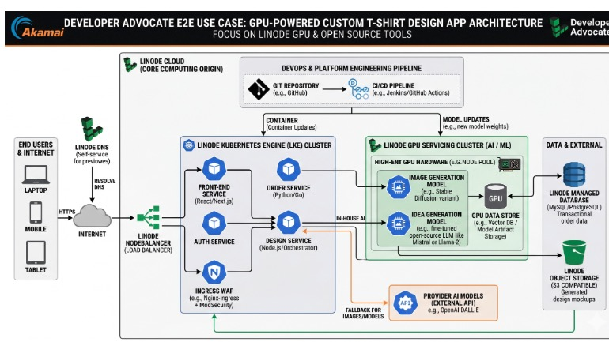

# Edgecase Apparel

A fantastical and fictional online apparel store and web application to demonstrate an end-to-end use case for cloud infrastructure. This use case demonstrates a web application that thrives on modern cloud-native disciplines. As the name "edgecase" would suggest, this application aims to satisfy the end user experience, by serving as much as possible from the nearest location across a geographically distributed architecture―as much as possible or makes sense. This provides a ton of fun constraints to work around and innovate. A project of this nature benefits from good practices around microservice architecture, stateless functions, automation and Platform Engineering. It also stands out as both a more interesting, and more unique opportunity for leveraging AI.

Furthermore, this project aims to remain as cloud agnostic and portable as possible, by leveraging cloud infrastructure primitives and open source tooling, and dodging managed services everywhere we can. It also keeps the local development experience front and center, acting as guidance for architecture and coding decisions. In other words, it needs to be testable! All of it!

See [docs](./docs) for architecture decision records (ADR) and other technical documentation produced along the way.

## Links shared during Live Streams

You can find a list of curated links that we shared during the live streams at [`./LINKS.md`](./LINKS.md).

## Discussion / Help

Join our [Discord](https://discord.gg/BTSf79H6E) and let's chat! We'll also be hosting a regular cadence of live coding/developing in public. Your feedback, ideas, and contributions are welcome.

## Contributing

Please follow the [Contributing Guidelines](CONTRIBUTING.md) when making a contribution.

## License

[BSD 3-Clause](LICENSE)
